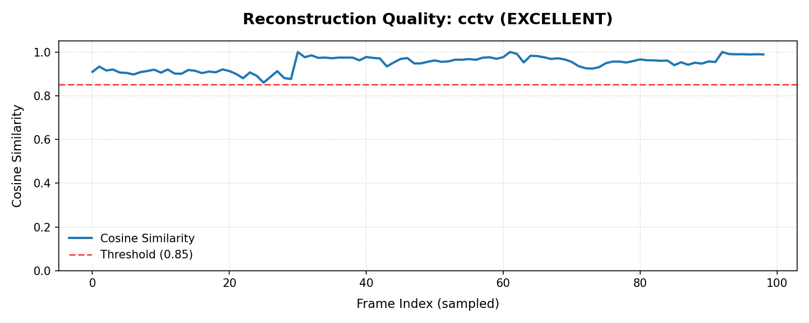
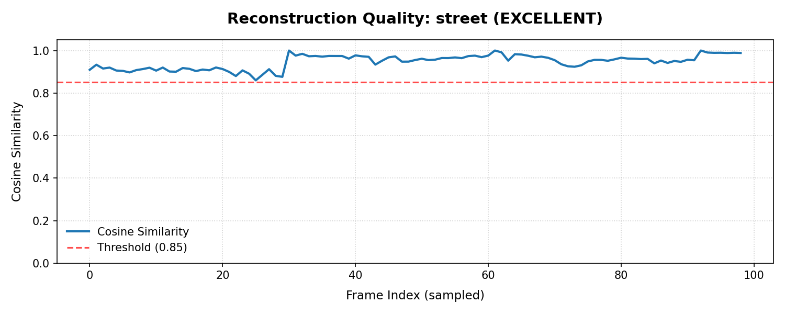

# ADVE Quality Test Report

## Summary
- Videos tested: 2
- Excellent/Good: 2
- Needs Work: 0
- Mean cosine sim: 0.9469
- Mean encoder savings: 96.0%
- Production ready: ✅ YES

## Per-Type Results

| Video Type | Mean Sim | Min Sim | Savings | Search | Verdict |
|------------|----------|---------|---------|--------|---------|
| cctv            | 0.9469 | 0.8598 | 96.0% | ✅ | EXCELLENT |
| street          | 0.9469 | 0.8598 | 96.0% | ✅ | EXCELLENT |

## Issues Found

## Quality Plots

### Cctv Quality Plot

### Street Quality Plot

