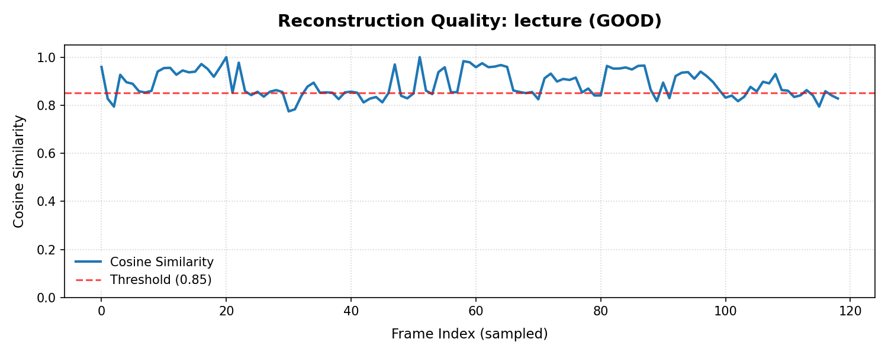
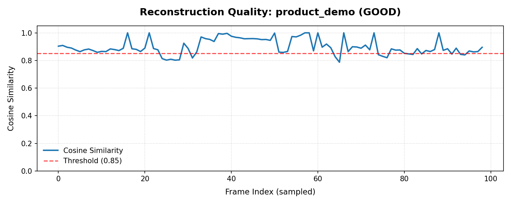

# ADVE Quality Test Report

## Summary
- Videos tested: 3
- Excellent/Good: 3
- Needs Work: 0
- Mean cosine sim: 0.9068
- Mean encoder savings: 90.0%
- Production ready: ✅ YES

## Per-Type Results

| Video Type | Mean Sim | Min Sim | Savings | Search | Verdict |
|------------|----------|---------|---------|--------|---------|
| lecture         | 0.8873 | 0.7743 | 97.3% | ✅ | GOOD |
| product_demo    | 0.8989 | 0.7872 | 90.0% | ✅ | GOOD |
| cctv            | 0.9341 | 0.8361 | 82.7% | ✅ | EXCELLENT |

## Issues Found

## Quality Plots

### Lecture Quality Plot

### Product_demo Quality Plot

### Cctv Quality Plot

